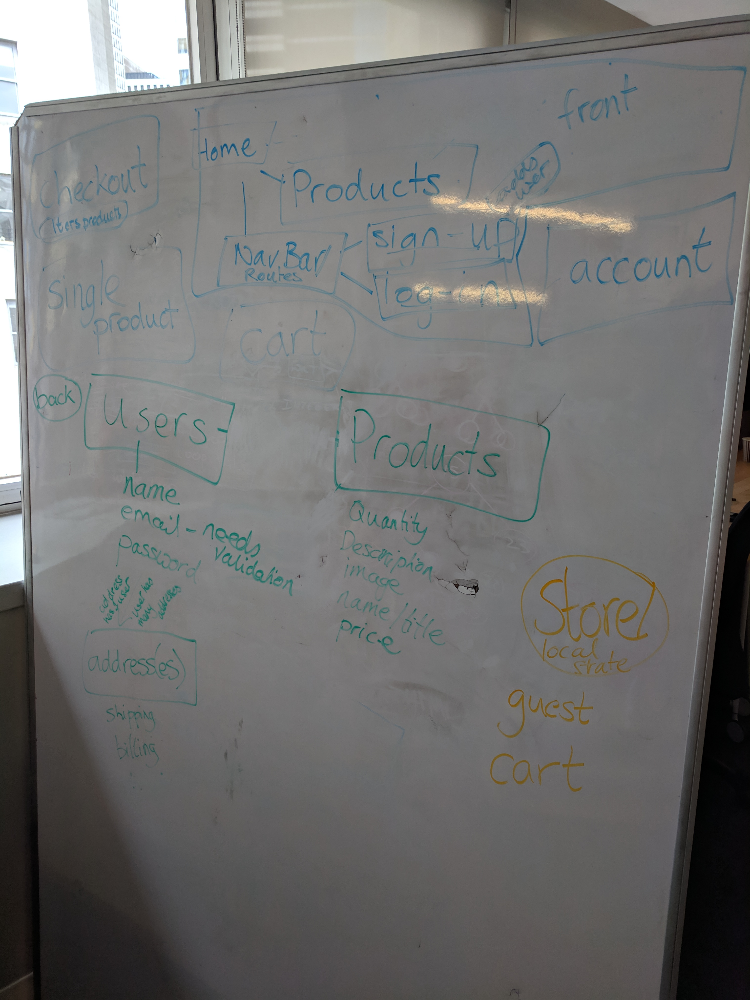
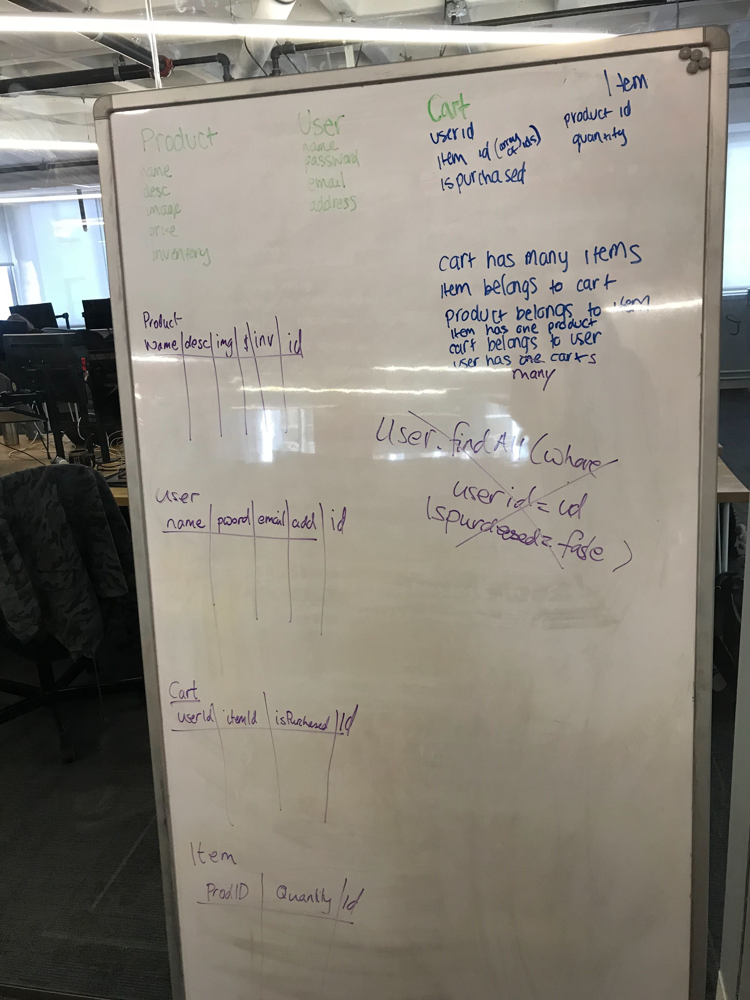

## Nineties Shopper - Now I want to See Amazon's Back-End!

### Planning

Grace Hopper (and thus also Fullstack) has a senior phase project called Grace-Shopper, where students work in teams to create an e-commerce site.  My team created a site called [Nineties Shopper](https://nineties-shopper.herokuapp.com) to sell furbies, gel pens and more to those who miss the 1990s. Setting up our site has been a fun adventure into creating a full-stack app with authentication (both local and with Google) and deploying with Heroku and Travis CI. It also gave really valuable practice in developing a project with a team, as most of my work before this project had been individual. 

We decided to use Git Hub's project board to manage our work and map out our user-stories.  Although there was at times a learning curve to make sure we properly numbered our sub-tasks and user stories, the time spent planning it out into separate tasks meant that we had a clearer idea for where our bracnhes and tasks should be, which was evntually helpful. 

The other major aspect of planning was mapping out our schema, which we re-visited twice as our project went on.  The photos below show our orginal schema and then the additions we made to add an items table that we could eagerly-load to show quantity in our cart. 

*Where we started with a users and products database*

*Updated schema where we added in carts and cart-items.  We also used req.session to store our guest cart*
